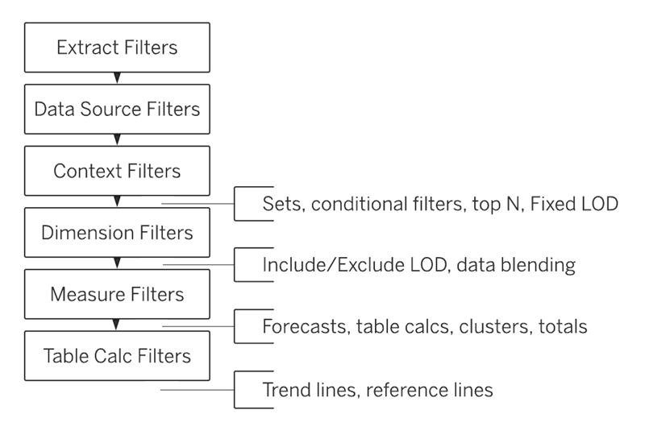

<h1><strong>Week-12 (May 21st - 26th, 2024)</strong>

 

<h1><strong>Meeting Agenda</strong></h1>

▶ Icebreaking (10m) 

▶ Micro Learning & Presentations (55m) 

▶ Project Discussion (10m)

 
 
 

<h1><strong>Teamwork Schedule</strong></h1>

<table style= "width:100%;">
                <tr>
                <td style="color: #FA8072; text-align:left "><h3><strong>
Ice-breaking</td>
                <td style="color: #FA8072; text-align:right;"><h3><strong>
10m
<td>                </tr>
</table>

- Personal Questions 
- Any challenges (Classes, Coding, studying, etc.) 
- How you’re studying? Do you need personal advice? 
- Remember that practice makes perfect. 
- What exactly does each student do for the team, if they know each other, if they care for each other, if they follow and talk with each other etc? 

 
 

<table style= "width:100%;">
                <tr>
                <td style="color: #FA8072; text-align:left "><h3><strong>
Micro Learning & Presentations</td>
                <td style="color: #FA8072; text-align:right;"><h3><strong>
55m
<td>                </tr>
</table>
(The problems and subjects in this part, have been prepared especially for you to equip yourself for the interview process and improve your coding skills. 
To get the most from this part, it’s highly recommended to be prepared and present the topics in English/German.
We strongly suggest that you force yourself to present especially the interview questions in English/German. 
This part's main and only aim is to develop the skills you need during and after the recruitment process and prepare you for the DS career.)

                  
  
<h3><strong>Questions & Problems Related to Course Topics</strong></h4>

**1. Use the Sample - Superstore.xlsx data set to answer the questions below:**

   - What are the top 10 products in Appliances sub-category? Plot the question and then download & open the tableau file in this week's folder and examine.

   - Order of Operations in Tableau (read and discuss with the team)

The order of operations in Tableau, sometimes called the query pipeline, is the order in which Tableau performs various actions. Actions are also known as operations. Many operations apply filters, which means that as you build a view and add filters, those filters always execute in the order established by the order of operations.

Sometimes, you might expect Tableau to execute filters in one order, but the order of operations dictates that they be executed in a different order, which gives you unexpected results. When this happens, you can sometimes change the order in which operations are executed in the pipeline.
The Tableau order of operations includes the following, from top to bottom.

                  
**2. How to prepare an interactive resume (read and discuss with the team)**
                  
  <b>
It is recommended that a team member prepare and submit a real or fake CV. 
</b>

  Go to the following link:

  https://www.tableau.com/about/blog/2018/7/building-interactive-resume-tableau-90974

  Then, read the article and review different types of interactive resumes created in Tableau in the article. 

  Go to the following link:

  https://public.tableau.com/en-us/s/interactive-resume-gallery
  
  In this link, there are several interactive resumes created in Tableau. Pick up one example and review it. 

  
<h3><strong>Interview Questions</strong></h4>

**1. What kind of filters are used in Tableau?**

**2. What is Context Filter?**

**3. What are parameters, sets, and groups?**

**4. What is a calculated field?**

**5. What is a dual axis?**

 

<table style= "width:100%;">
                <tr>
                <td style="color: #FA8072; text-align:left "><h3><strong>
SELF STUDY - ADDITIONAL RESOURCES</td>
                </tr>
</table>

**1. Please read/watch the following articles/videos related to this week's topics, which you can discuss within the group. The articles/videos shared with you below will help you better understand the topics.**

   **Articles**

   - [How to create effective charts and diagrams](https://kipkis.com/Lesson_5:_How_to_create_effective_charts_and_diagrams)                  
                  
   - [6 Types of Filters in Tableau: How You Should Use Them](https://www.upgrad.com/blog/types-of-filters-in-tableau-how-to-use-them/)

   - [Creating groups and drillable hierarchies in Tableau](https://www.thedataschool.co.uk/ben-davis/creating-groups-drillable-hierarchies-tableau/)

   - [Create Efficient Combined Data Sources with Tableau](https://www.kdnuggets.com/2022/05/create-efficient-combined-data-sources-tableau.html)

   - [Get Started with Calculations in Tableau](https://help.tableau.com/current/pro/desktop/en-us/calculations_calculatedfields_create.htm)

   - [What are Parameters in Tableau and How to Implement Them](https://www.simplilearn.com/tutorials/tableau-tutorial/parameters-in-tableau)

   - [Tutorial: Get Started with Tableau Desktop](https://help.tableau.com/current/guides/get-started-tutorial/en-us/get-started-tutorial-home.htm)

   **Videos**

   - [How to use Tableau: Tutorial for Beginners](https://www.youtube.com/watch?v=JGU2QdNCs2w)  

**2. Self study for DA&DVwPy. We have a brand new dataset for an EDA study. This Exploratory Data Analysis (EDA) will focus on overall Data Analyst job title, job description, salary estimate. You'll be analyzing a dataset that contains more than 2000 job listing for data analyst positions, with features such as **Salary Estimate**, **Location**, **Company Rating**, **Job Description** and more. You are expected to come up with different analyzes such as **finding the best jobs by salary and company rating**, **explore skills required in job descriptions**, **predict salary based on industry, location, company revenue**. Good luck!**
                  
   - [Exploratory Data Analysis (EDA) of Data Analyst Jobs_Student](https://github.com/clarusway/DS-DE0824-TR-DA-Students/blob/main/2-%20Weekly%20Agendas/Week_12_Agenda/EDA_Data_Analyst_Job_Student.ipynb)

<be>

<table style= "width:100%;">
                <tr>
                <td style="color: #FA8072; text-align:left "><h3><strong>
PROJECT DISCUSSION</td>
                </tr>
                
</table>

- [Tableau Assignment-3(TABL - Makeover Monday)](https://lms.clarusway.com/mod/assign/view.php?id=60617&forceview=1)  

- [Project: Tableau-1 (Sales Analysis of a Website)](https://github.com/clarusway/DS-DE0824-TR-DA-Students/tree/main/3-%20Projects/Tableau-1%20(Sales%20Analysis%20of%20a%20Website))  

- [Project: Tableau-2 (Covid-19 Dashboard)](https://github.com/clarusway/DS-DE0824-TR-DA-Students/tree/main/3-%20Projects/Tableau-2%20(Covid-19%20Dashboard))  

- Flipgrid-11 (What is business intelligence?)
